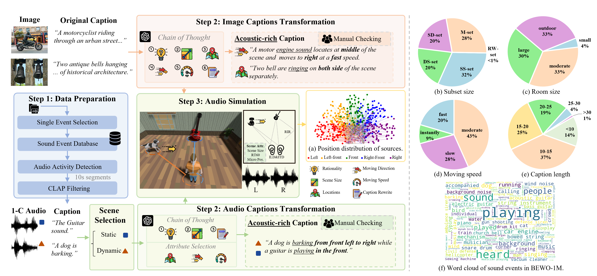

#  <br>Both Ears Wide Open: Towards Language-Driven Spatial Audio Generation

Keywords:


 

The official repo for Both Ears Wide Open: Towards Language-Driven Spatial Audio Generation

<div style='display:flex; gap: 0.25rem; '>
Community Contribution: <a href='http://143.89.224.6:2436/'></a><a href='http://143.89.224.6:2437/'></a>
<a href='https://github.com/PeiwenSun2000/Both-Ears-Wide-Open/tree/main/datasets'></a>
<a href='todo'></a>
<a href='https://arxiv.org/abs/2410.10676'></a>
</div>

## Outlines
- 💥 News 💥
- 👀 Overall Structure
- 📊 BEWO-1M Dataset
- 🏆 Usage
- 📝 Evaluation
- 📜 License
- 🤝 Contributors

## 💥 News 💥

[2025.01.24] Our preview version of BEWO-1M is released in <a href='https://github.com/PeiwenSun2000/Both-Ears-Wide-Open/tree/main/datasets'></a> with instructions.

[2025.01.23] Our paper is accepted by ICLR 2025! See you in Singapore.

[2024.10.14] Our initial paper is now accessible at <a href='https://arxiv.org/abs/2410.10676'></a>.


## Overall Structure

*  Dataset: [Data instruction for BEWO](https://github.com/PeiwenSun2000/Both-Ears-Wide-Open/tree/main/datasets)
*  Inference: [Inference code for BEWO](https://github.com/PeiwenSun2000/Both-Ears-Wide-Open/tree/main/models) (Coming soon.)
*  ITD Evaluation: [Evaluation code for BEWO](https://github.com/PeiwenSun2000/Both-Ears-Wide-Open/tree/main/evaluations) (Coming soon.)

## BEWO-1M Dataset

To better facilitate the advancement of multimodal guided spatial audio generation models, we have developed a dual-channel audio dataset named Both Ears Wide Open 1M (BEWO-1M) through rigorous simulations and GPT-assisted caption transformation.

<p align="center">
     <br>
</p>

Totally, we constructed 2.8k hours of training audio with more than 1M audio-text pairs and approximately 17 hours of validation data with 6.2k pairs.

The full dataset of BEWO-1M can be find in here. <a href='https://github.com/PeiwenSun2000/Both-Ears-Wide-Open/tree/main/datasets'></a>

# Requirements

Requires PyTorch 2.0 or later for Flash Attention support

Development for the repo is done in Python 3.8.10

This code base is adapted from [stable-audio-tools](https://github.com/Stability-AI/stable-audio-tools). Sincere thanks to the engineers for their great work.

# Model Gallery

Coming Soon...

<!-- | Model           | GDrive   | Baidu    | Detail                                            |
|-----------------|----------|----------|---------------------------------------------------|
| BEWO_nl.ckpt    | [link]() | [link]() | Training with natural language only               |
| BEWO_attr.ckpt | [link]() | [link]() | Training with induction attributes only           |
| BEWO_mix.ckpt   | To Be Updated | To Be Updated | Training with both natural language and induction | -->

# Usage

## Simple generation:


To generate audio from a text prompt using our pretrained model:

1. Download the pretrained model and config files from [MODEL_LINK]
2. Place the model checkpoint at `/path/to/final.ckpt` 
3. Place the model config at `/path/to/model_config_sim.json`
4. Run the following command:


```
python simple_generation.py --prompt "A dog is barking on the left." --device cuda:0

```


## Coarse-to-fine generation:

To generate audio from a text prompt using our pretrained model:

1. Download the pretrained model and config files from [MODEL_LINK]
2. Place the model checkpoint at `/path/to/final_c2f.ckpt` 
3. Place the model config at `/path/to/model_config_sim_c2f.json`
4. Run the following command:

The GPT induction is used to generate the spatial attributes. We offer two models for you to choose. [GPT-4o](https://platform.openai.com/docs/models/gpt-4o) and [DeepSeekv3](https://www.deepseek.com/). Since the DeepSeek model is much cheaper and opensourced, using it can be considered as a cost-effective solution.

Using GPT induction:
```
python gpt_induction.py --prompt "A dog is barking on the left." --device cuda:0
python gpt_induction.py  --prompt "a dog is barking and running from left to right." --device cuda:0
```

We also provide a manual setting for you to manually set the initial and final direction and moving state. The direction is from 1 (left) to 5 (right). The moving state is from 0 (no moving) to 3 (fast moving).

Using manual setting:
```
python gpt_induction.py --prompt "a dog is barking." --device cuda:0 --manual True --init_direction 1 --final_direction 1 --moving 0
python gpt_induction.py --prompt "a dog is barking." --device cuda:0 --manual True --init_direction 1 --final_direction 5 --moving 1
```


# Reference

If you find this repo useful, please cite our papers:

```
@article{sun2024both,
  title={Both Ears Wide Open: Towards Language-Driven Spatial Audio Generation},
  author={Sun, Peiwen and Cheng, Sitong and Li, Xiangtai and Ye, Zhen and Liu, Huadai and Zhang, Honggang and Xue, Wei and Guo, Yike},
  journal={arXiv preprint arXiv:2410.10676},
  year={2024}
}
```

Please also cite stable-audio-tools paper if you use the code in this repo. Thanks again for their great work.
```
@article{evans2024stable,
  title={Stable audio open},
  author={Evans, Zach and Parker, Julian D and Carr, CJ and Zukowski, Zack and Taylor, Josiah and Pons, Jordi},
  journal={arXiv preprint arXiv:2407.14358},
  year={2024}
}
```